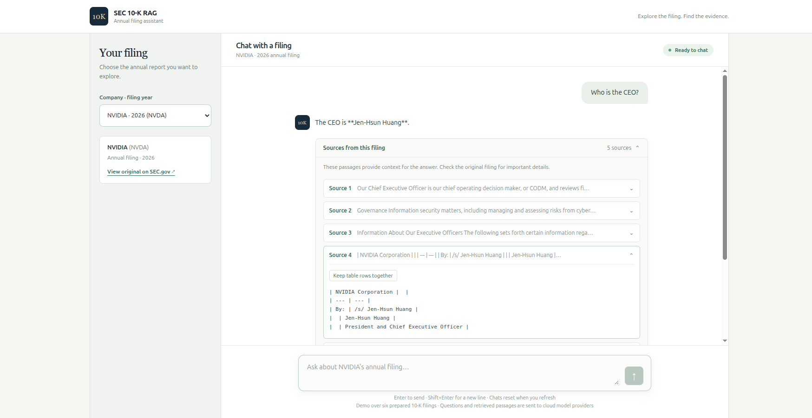
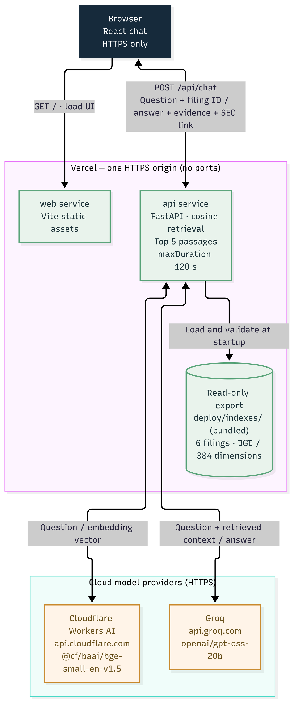
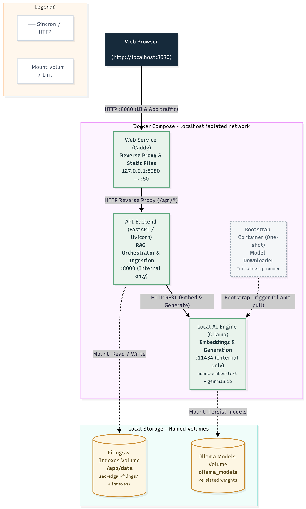

# SEC 10-K RAG

Chat with SEC annual reports and inspect the passages behind each answer.
**[Live demo](https://sec-10k-rag-rauls-projects-2096a6fa.vercel.app)**

## Demo video

https://github.com/user-attachments/assets/572999e0-1d28-47ff-9820-442d7df0f8ad

The public app serves six prepared 10-K filings: NVIDIA, Amazon, Starbucks, Adobe, Pfizer and Ford.
React/Vite provides the chat UI; FastAPI handles retrieval and generation. Each question is independent,
with no accounts, persistent conversation history, vector database or orchestration framework.



## What I built myself

- Implemented the pipeline and product code by hand across the roadmap: SEC parsing/cleaning, semantic chunking,
  cosine similarity, retrieval and RAG orchestration.
- Operated the deployment end to end: Vercel project and secrets, staged candidates, smoke checks, controlled
  promotion, and the key-rotation/exposure hygiene around them.

## How it works

```text
Preparation: verified SEC submission -> parse -> clean tables/HTML -> chunk -> embed -> filing index
Question:   embed -> cosine search within one filing -> top passages -> generated answer + evidence
```

| Profile | Embeddings | Generation | Index storage |
| --- | --- | --- | --- |
| Local (default) | Ollama `nomic-embed-text` / 768 dimensions | Ollama `gemma3:1b` | `data/indexes/` |
| Cloud | Cloudflare `@cf/baai/bge-small-en-v1.5` / 384 dimensions | Groq `openai/gpt-oss-20b` | Tracked `deploy/indexes/` |

The embedding spaces stay separate. Cloud queries use a checksummed, read-only export loaded into memory;
preparation runs separately in an operator shell. Cloud providers have no automatic model fallback.

Code: [pipeline](etl_pipeline/) · [API](api/) · [UI](frontend/src/) · [evaluation](eval/).

### Serverless production architecture (cloud runtime — Vercel & managed APIs)

The production runtime topology, optimized for automatic scaling and zero operational maintenance
through fully managed cloud services:

- **Single entry point:** one Vercel HTTPS domain; routing separates static assets (React/Vite)
  from dynamic data requests.
- **Ephemeral backend:** FastAPI as a serverless function with `maxDuration: 120 s`, for long analytical queries.
- **Built-in vector index:** read-only binary artifact in the deployment bundle (`deploy/indexes/`) —
  6 SEC documents, 384-dimension BGE vectors — validated and loaded into memory at startup (cold start),
  with no external vector database.
- **Decoupled inference:** embeddings via Cloudflare Workers AI (`bge-small-en-v1.5`), answers via
  Groq (`gpt-oss-20b`) for minimal latency.



### RAG pipeline — request flow (one cloud question)

Generation slot reserved, filing resolved from the frozen export, question embedded via Cloudflare
(cached), cosine similarity, answer generated via Groq — all under one shared deadline:


### Local containerized architecture (self-hosted / isolated Docker stack)

The self-sufficient local deployment, for full data privacy and operation independent
of third-party cloud providers:

- **Isolated perimeter:** private Docker network; a single port (`8080`) mapped to the host. `api` and `ollama`
  do not expose their ports directly, preventing unauthorized access.
- **Ingress & reverse proxy (Caddy):** `127.0.0.1:8080` traffic reaches the static files in `/srv`,
  while `/api/*` is routed to the backend.
- **Local RAG orchestration:** FastAPI/Uvicorn calls Ollama over HTTP REST for embeddings and generation.
- **Automatic bootstrap:** the ephemeral `models` container downloads the weights once
  (`nomic-embed-text`, `gemma3:1b`), with no manual steps.
- **Persistence via named volumes:** `filings` (`/app/data`) and `ollama_models`, decoupled from the
  containers' lifecycle.



## Get started

Commands below use Bash on Linux/macOS or WSL. Clone once and run commands from the repository root:

```bash
git clone https://github.com/raul-muresan03/sec-rag-tool.git
cd sec-rag-tool
```

Choose **[Docker](#docker-quickstart)** to try the app, **[native development](#native-development)** to edit it,
or **[local cloud queries](#local-cloud-queries)** to use the hosted models.

### Docker quickstart

Requires Docker with Compose, internet access, a SEC contact email and disk space for images/models.
Python, Node and Ollama are provided by the containers.

```bash
test -f .env || cp .env.example .env
# Edit SEC_API_EMAIL in .env to your real contact email; keep the local defaults.
docker compose up --build
```

Open **http://localhost:8080**. Models download on first start. Select one filing to download its exact SEC
submission, verify its checksum and build its index. Wait for `ready`; preparing all six is optional.
First-time indexing can take several minutes on CPU. Only the web port is exposed, bound to localhost.

```bash
curl http://localhost:8080/api/health   # process: {"status":"ok"}
curl http://localhost:8080/api/ready    # models: ready, or 503 while unavailable
curl http://localhost:8080/api/filings  # per-filing preparation status
docker compose logs models api ollama # download, preparation and model errors
docker compose down                  # stop; keep downloaded data and models
```

After editing `.env`, run `docker compose up -d --force-recreate` to refresh all services, including web-port
settings and the model downloader. Set `WEB_PORT` if 8080 is taken. `down -v` deletes the data/model volumes.

### Native development

Use Python **3.12**, Node.js **22** with npm, and [Ollama](https://ollama.com/) for the local-model profile.
The UI targets desktop screens (1024px or wider).

#### Python environment

This installation step is shared by local and cloud profiles:

```bash
python3 -m venv venv
source venv/bin/activate
python -m pip install -r etl_pipeline/requirements.txt -r requirements-api.txt -r requirements-dev.txt
test -f .env || cp .env.example .env
```

#### Prepare a local filing

Start Ollama at `http://localhost:11434` (`ollama serve` if it is not already running).
Set your real `SEC_API_EMAIL` in `.env`; keep `RAG_RUNTIME=local`, `RAG_MODEL=gemma3:1b` and
`FILING_PREPARATION_ACCESS=browser`. With the virtual environment active:

```bash
set -a
. ./.env
set +a
ollama pull nomic-embed-text
ollama pull gemma3:1b
python -m api.prepare_filings --filing-id 1045810-0001045810-26-000021
python ask.py --ticker NVDA --year 2026 'How does NVIDIA assign revenue geographically?'
```

The preparation command downloads, verifies and indexes each selected filing in turn; omit `--filing-id` for
all six. Raw filings and indexes stay in ignored `data/`. `ask.py` does not download missing submissions.
`--year` means SEC filing year. The CLI defaults to five passages and logs local answers in `data/query_log.jsonl`.

#### Start the API and UI

Terminal 1, from the repository root (reload the environment after changing profiles):

```bash
source venv/bin/activate
set -a
. ./.env
set +a
python -m uvicorn api.main:app --host 127.0.0.1 --port 8000 --reload
```

Terminal 2, also from the repository root:

```bash
npm --prefix frontend ci
npm --prefix frontend run dev -- --port 5173
```

Open **http://localhost:5173**; Vite proxies `/api` to port 8000. In `browser` mode, selecting an unprepared
filing starts preparation. In `operator` mode, only ready filings appear and HTTP preparation returns 403.
One prepared filing is enough to chat. Check the native API at `http://localhost:8000/api/ready`.

### Local cloud queries

Complete the [Python environment](#python-environment) step first. Configure free Groq and Cloudflare accounts
without paid fallback, then edit your ignored `.env` with the backend-only settings below. Keep credentials out of
commits and `VITE_*` variables. See [provider configuration](MODEL_PROVIDERS.md#configuration) for details.

```ini
RAG_RUNTIME=cloud
RAG_MODEL=openai/gpt-oss-20b
FILING_PREPARATION_ACCESS=operator
RAG_SNAPSHOT_DIR=deploy/indexes
GROQ_API_KEY=your_key
CLOUDFLARE_API_TOKEN=your_token
CLOUDFLARE_ACCOUNT_ID=your_32_character_account_id
```

In the activated Python environment:

```bash
set -a
. ./.env
set +a
python ask.py --ticker NVDA --year 2026 'How does NVIDIA assign revenue geographically?'
```

This uses the bundled export and needs neither Ollama nor raw SEC files. For the UI, follow
[Start the API and UI](#start-the-api-and-ui) with this cloud environment and Node.js 22.

## Checks and common problems

With the virtual environment active, run checks using the local defaults:

```bash
RAG_RUNTIME=local RAG_MODEL=gemma3:1b FILING_PREPARATION_ACCESS=browser python -m pytest -q
npm --prefix frontend run build # typecheck + production build; run npm ci first
```

CI also validates the internal evaluation snapshot and builds the Docker images. Tests mock SEC/model HTTP;
a successful live chat is a separate end-to-end check.

| Symptom | Next step |
| --- | --- |
| Local filing is not ready | Check preparation status/logs, then use **Try again** after fixing the cause. |
| Cloud 429 | Wait for provider quota recovery; use the response's `Retry-After` hint. |
| 504 timeout | Check model availability and latency; local Ollama and cloud use different timeout settings. |
| Snapshot checksum mismatch | Verify/restore the matching export. Rebuild only into a new candidate directory. |

See the [API runbook](api/README.md#configuration-and-errors) for endpoints, preparation modes and error details.

## Evaluation

The corpus has **24 dev questions** for development and **16 test questions** for final evaluation.
Test filings are indexed separately and excluded from the public export.

| Cloud run | Hit@5 | Multi-hop complete evidence@5 | Correct no-answer abstentions |
| --- | --- | --- | --- |
| Dev `20261002T133927181691Z-dev-cloud` (retrieval only) | 14/18 | 6/6 | — |
| Test `20261004T162542904468Z-test-cloud` (full generation) | 10/12 | 3/4 | 4/4; zero false abstentions |

These are automatic evidence-match/abstention metrics, not reviewed answer-accuracy scores. The test run used
29,013 tokens; mean retrieval/generation latency was 0.41/0.72 seconds from a laptop using cloud providers.
Those timings are not Vercel benchmarks. [Historical Ollama answer reviews](eval/reviews/README.md) are separate.

Rebuilding an export needs the raw **dev** submissions; rerunning the [final cloud evaluator](eval/final_eval.py)
needs all four raw **test** submissions at their [manifest paths](eval/corpus_manifest.v1.json), plus cloud credentials
and network access. The [freeze check](eval/frozen_behavior.v1.json) compares declared embedding/chunking settings;
it does not enforce source-code or prompt immutability. Evaluation is optional for application setup.

## Challenges and limitations

- **Embedding compatibility:** local Nomic and cloud BGE indexes use separate identities and storage.
- **Cloud preparation:** token-bounded chunking and checksummed exports make prepared filings usable on Vercel.
- **Release control:** passing CI triggers a staged deployment; smoke checks precede production promotion.
- Answers can misstate facts or units. Passages and SEC links are inspectable, but there are no claim-level citations.
- Each question uses one filing, without conversation memory, cross-filing search or streaming.
- Retrieval scans every vector. Generation limits are per instance; shared Free quotas can interrupt cloud service.

Next improvements: claim-level citations, streaming, per-user limits and measured Vercel cold-start latency.

## Further reading

| Topic | Guide |
| --- | --- |
| HTTP API, preparation and errors | [api/README.md](api/README.md) |
| Models, credentials and input limits | [MODEL_PROVIDERS.md](MODEL_PROVIDERS.md) |
| Snapshot provenance, dimensions and rebuilding | [CLOUD_INDEXES.md](CLOUD_INDEXES.md) |
| Vercel setup, release and recovery | [VERCEL.md](VERCEL.md) |
| Corpus, metrics and answer review | [eval/README.md](eval/README.md) |
| Historical local performance | [perf/results.md](perf/results.md) |
